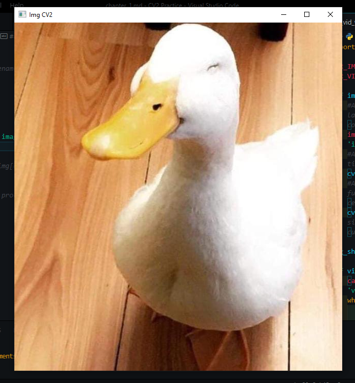

# Read a image file
```python
# My directory files

DIR_IMAGES = '..\\src\\images\\'
DIR_VIDEO = '..\\src\\videos\\'

# Read the image file

img = cv.imread(DIR_IMAGES + 'image_01.png')

# Open new window with show a img[array]

cv.imshow("Img CV2", img)

# Wait a press any key for next de process

cv.waitKey(0)
```
> Result:
> 

Line code for closing image

```python
# Close Windows, an insert name the window

cv.destroyWindow('Img CV2')
```

> imread()
```python
# The parameters is de file directory of image
img_array = cv.imread(directory_str)
```

> imshow()
```python
# Parameters is the name of window and img array
cv.imshow('Name Window', img_array)
```

> waitKey()
```python
# If parameter is 0, the waitKey() waiting for pressed any key in the window, and go th read next code
cv.waitKey(0)

# But, too recieved a integer parameter, equals a miliseconds for waiting lapse
cv.waitKey(10) # 10 milliseconds waiting

# Always return a key pressed in ASCII
ascii_value =  cv.waitKey() # 10 milliseconds waiting
```

> destroyWindow()
```python
# Parameters is the name of window a destroy
cv.destroyWindow('Name Window')
```

# Read a video file

```python
# Read the video file
cap = cv.VideoCapture(DIR_VIDEO + 'video_01.mp4')

# Inizialize the while loop

while True:

    # Read the video fream per fream, save frame in img array
    success, img = cap.read()

    # If read image in video, show frame
    if success:

        # Show frame in window
        cv.imshow('Video CV2', img)

        # Wait interval of 20 milliseconds
        # And evaluate if key pressed is 'q'
        if cv.waitKey(20) & 0xFF == ord('q'):

            # If key pressed is 'q', exit the loop
            break

    # If not success read image, exit the loop
    else:
        break
```

> Result:
> 

Line code for closing video capture

```python
# Closes video file or capturing device.
cap.release()
cv.destroyWindow('Video CV2')
```

> VideoCapture()
```python
# The parameters is de file directory of video or webcame divice
videocapture = cv.VideoCapture(directory_video)

# If integer value of parameter, return webcam capture
videocapture = cv.VideoCapture(0) #Defualt the webcam capture is 0
```

> videocapture.read()
```python
# Boolean: Boolean value if the video can read frame
# Array: Array image of video frame
success, img_frame = cap.read()
```

> videocapture.release()
```python
# Closes video file or capturing device.
cap.release()
```

# Read a video file

```python
# Capture webcam
cap = cv.VideoCapture(0)

# Set video dimensions
cap.set(3, 640)
cap.set(4, 480)
# Set video brightness
cap.set(10, 100)

# Initialize video capture loop, almost same a video capture loop
while True:
    success, img = cap.read()
    cv.imshow('Webcam CV2', img)
    if cv.waitKey(1) & 0xFF == ord('q'):
        break
cap.release()
cv.destroyWindow('Webcam CV2')
```

> Result:
> 